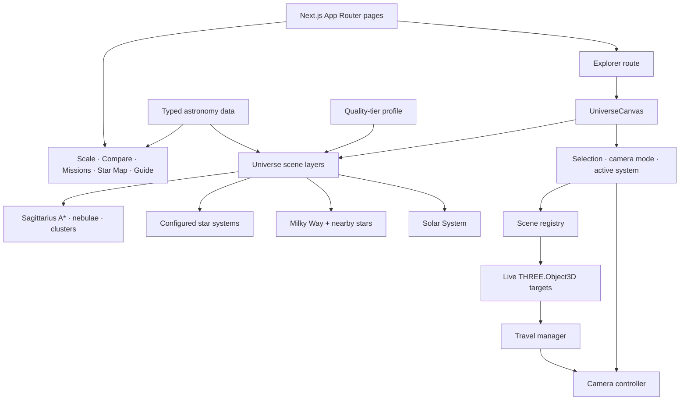

# ASTRA

### Interactive 3D Universe Explorer

[](https://nextjs.org/)
[](https://react.dev/)
[](https://threejs.org/)
[](https://www.typescriptlang.org/)

ASTRA is an interactive, browser-based universe explorer that connects the Solar System, nearby stellar systems, the Milky Way, and selected deep-sky objects in one navigable 3D experience. It combines educational visualization, deterministic astronomy data, camera-driven exploration, and device-aware rendering in a portfolio-scale Next.js application.

> Hero capture target: `docs/screenshots/astra-hero.png`. The image is intentionally not embedded until a final application screenshot has been captured.

## Live Demo

**Coming soon.** The deployment URL will be added after the production release is verified.

## Project Overview

ASTRA is designed around exploration at multiple astronomical scales. A visitor can start at a planet, move through a star system, pull back to the Milky Way, inspect the Local Stellar Neighborhood, and enter another modeled system without switching to a disconnected visualization.

Selection and travel are deliberately separate. Selecting an object updates the information context; targeting it asks the camera to move. This keeps the interface predictable and allows moving planets, moons, and specialty scenes to remain interactive while the camera is in transit.

## Key Features

- Continuous-feeling navigation across Solar System, galaxy, nearby-star, and local star-system views
- Interactive Solar System with animated orbital motion and an Earth/Moon model with tidal locking
- Milky Way visualization with up to 55,000 procedurally distributed points
- Local Stellar Neighborhood with deterministic markers, labels, and entry into modeled systems
- Dedicated TRAPPIST-1, Sagittarius A*, Orion Nebula, and star-cluster scenes
- Object selection, camera targeting, free-flight controls, deep links, and browser-history restoration
- Educational Scale, Compare, Mission Control, Star Map, and ASTRA Guide routes
- Device-aware high, medium, and low quality tiers with adaptive point budgets and pixel ratios
- Typed, deterministic astronomy data and source notes for reproducible output
- 28 deterministic tests covering motion, navigation, performance tiers, the Guide, and data validation

## Scientific Motion

ASTRA uses time-based orbital state rather than frame-count animation. Keplerian helpers solve eccentric anomaly and convert orbital elements into stable positions, while local system configurations provide periods, eccentricities, inclinations, and display-scale distances.

The Earth/Moon scene handles the Moon as a moving child body and points the same lunar hemisphere toward Earth. Rotation and revolution are derived from the shared simulation time, avoiding frame-rate-dependent drift. The visualization is educational: distances, radii, and time are compressed so motion remains readable at browser scale.

The Asteroid Belt and Kuiper Belt combine point populations with a deterministic sample of irregular instanced bodies. Individual bodies are procedurally sampled for visualization; population, sizes and spacing are compressed for readability.

## Astronomy Data & Sources

Scientific values live in typed static modules under `src/data/astronomy/`, with human-readable attribution exposed through the Sources interface. The project draws on authoritative public references including NASA, JPL, ESA, the IAU, and mission-specific public datasets.

The data policy favors reproducibility:

- Keep canonical records separate from display labels and visual scale.
- Store source metadata near the values it supports.
- Validate high-risk facts, ranges, relationships, and duplicate identifiers in tests.
- Describe specialty scenes as educational visualizations when their geometry is illustrative.
- Use static snapshots for mission telemetry instead of implying live spacecraft data.

See the in-app Sources route at [`/sources`](http://localhost:3000/sources) for the detailed source catalog.

## Architecture



`UniverseCanvas` is the explorer's composition root. It coordinates global selection, the active orbit target, camera mode, active star system, overlays, and conditionally mounted scene layers. Domain logic is kept outside route components in focused engine modules for astronomy, camera control, navigation, guide behavior, performance, registry, and scale conversion.

## Navigation Architecture

Navigation follows a registry-based target model:

1. Rendered objects register their live `THREE.Object3D` references in the scene registry.
2. Selection records object identity without forcing camera movement.
3. A travel command resolves the current live target through the travel manager.
4. The camera controller follows the target as its world position changes.
5. Deep links and history state restore the intended destination at route entry.

Resolving live scene objects at travel time prevents stale coordinates when an orbital body moves between selection and arrival. Manual camera input can take ownership cleanly instead of competing with an active scripted transition.

## Star System Architecture

Modeled systems use reusable configuration rather than one component per star. A `StarSystemConfig` describes the star, its planets, orbital parameters, rendering scale, and metadata. The shared renderer consumes that configuration for Solar System and exoplanet-system scenes, while specialty phenomena remain isolated components where their visual requirements differ substantially.

Galaxy-level markers use fixed coordinates and deterministic label offsets. Entering a system changes the active local context; it does not mutate the canonical catalog record or marker location.

## Performance

ASTRA selects a conservative quality tier from device signals and applies one coherent render profile. The profile controls device pixel ratio, point-population scales, orbit segments, and the cost of galaxy, background-star, belt, nebula, and cluster layers.

| Profile | Maximum DPR | Milky Way | Star field | Sky band | Belt points |
| --- | ---: | ---: | ---: | ---: | ---: |
| High | 2.00 | 55,000 | 9,160 | 5,600 | 9,800 |
| Medium | 1.50 | 41,800 | 7,511 | 4,592 | 7,840 |
| Low | 1.25 | 27,500 | 5,313 | 3,360 | 5,390 |

Static point populations and geometry inputs are memoized so ordinary interaction does not regenerate them. Expensive specialty scenes are mounted only when relevant, inactive systems are simplified, and decorative effects respect reduced-motion preferences. These are rendering budgets rather than FPS claims; performance still depends on browser, GPU, display resolution, and scene state.

## Key Engineering Decisions

- Separate object selection from camera targeting.
- Resolve moving destinations through a registry of live scene objects.
- Compress astronomical scale instead of pretending literal distances and radii are simultaneously usable.
- Mount heavy specialty scenes only when their context is active.
- Use a deterministic, locally implemented Guide rather than presenting generated responses as scientific authority.
- Keep authoritative data static and typed for traceability and reproducibility.
- Scale pixel ratio, particle counts, and geometry detail together through explicit quality tiers.
- Preserve stable marker coordinates and deep-link identifiers while allowing presentation labels to evolve.

## Tech Stack

- Next.js 16 App Router
- React 19 and TypeScript 5
- Three.js with React Three Fiber and Drei
- Tailwind CSS 4 plus component-scoped CSS
- Node.js built-in test runner
- ESLint with the Next.js configuration
- WebGL in modern desktop and mobile browsers

## Routes

| Route | Purpose |
| --- | --- |
| `/` | Landing page and project entry point |
| `/explore` | Main 3D universe explorer |
| `/explore?target=…` | Deep-linked explorer destination |
| `/scale` | Interactive astronomical scale experience |
| `/compare` | Object comparison tool |
| `/missions` | Mission catalog |
| `/missions/[mission]` | Mission detail view |
| `/mission-control` | Voyager-oriented telemetry snapshot and mission context |
| `/star-map` | Interactive constellation map |
| `/guide` | Deterministic astronomy question-and-answer interface |
| `/sources` | Scientific source catalog |
| `/about` | Project background and scope |

## ASTRA Guide

The ASTRA Guide is a deterministic astronomy assistant, not a generative AI or ChatGPT-style service. A typed local provider normalizes the question, identifies supported intents and entities, and returns answers assembled from curated project data. This makes answers fast, inspectable, testable, and available without an external API key or network dependency. Unsupported questions receive bounded guidance instead of fabricated facts.

## Screenshots

Final screenshots have not been committed yet, so no broken image embeds are rendered here. Capture instructions are in [docs/SCREENSHOT_GUIDE.md](docs/SCREENSHOT_GUIDE.md).

- [ ] `01-landing.png`
- [ ] `02-solar-system.png`
- [ ] `03-earth-moon.png`
- [ ] `04-galaxy.png`
- [ ] `05-nearby-stars.png`
- [ ] `06-trappist-1.png`
- [ ] `07-sagittarius-a.png`
- [ ] `08-orion-nebula.png`
- [ ] `09-scale.png`
- [ ] `10-compare.png`
- [ ] `11-mission-control.png`
- [ ] `12-star-map.png`
- [ ] `13-guide.png`

## Project Structure

```text
src/
├── app/                    # Routes, layouts, and global styling
├── components/
│   ├── universe/           # WebGL scenes, overlays, and explorer controls
│   ├── ui/                 # Shared interface components
│   ├── guide/              # Guide presentation
│   ├── mission-control/    # Mission telemetry presentation
│   ├── compare/            # Object comparison experience
│   ├── scale/              # Astronomical scale experience
│   └── star-map/           # Constellation map
├── data/
│   ├── astronomy/          # Scientific records and source metadata
│   ├── guide/              # Guide content
│   ├── missions/           # Mission records
│   └── starmap/            # Constellation data
└── engine/
    ├── astronomy/          # Orbital mechanics
    ├── camera/             # Camera ownership and transitions
    ├── navigation/         # Destination and travel logic
    ├── registry/           # Live object registration
    ├── performance/        # Quality-tier profiles
    ├── guide/              # Deterministic query engine
    └── scale/              # Display-scale conversion
```

Additional project documentation:

- [Portfolio Case Study](docs/PORTFOLIO_CASE_STUDY.md)
- [Interview Notes](docs/INTERVIEW_NOTES.md)
- [Screenshot Capture Guide](docs/SCREENSHOT_GUIDE.md)
- [Final QA Checklist](docs/FINAL_QA_CHECKLIST.md)

## Local Setup

Prerequisites: Node.js 20.9 or newer and npm.

```bash
git clone https://github.com/Amit2298T/astra.git
cd astra
npm install
npm run dev
```

Open [http://localhost:3000](http://localhost:3000). No external API key is required for the core experience or ASTRA Guide.

## Testing

```bash
npm test
npx tsc --noEmit --incremental false
npm run lint
npm run build
git diff --check
```

The current 28 deterministic tests cover performance-profile selection, star-system data and local destinations, orbital motion and Moon tidal locking, Guide intent/entity behavior, and astronomy-data validation. The repository does not currently include automated browser end-to-end or visual-regression tests; those flows are covered by the manual [final QA checklist](docs/FINAL_QA_CHECKLIST.md).

## Deployment

ASTRA is compatible with a standard Next.js production deployment. For Vercel, import the repository, keep the detected Next.js defaults, use Node.js 20.9 or newer, and run `npm run build`. A public deployment link will replace the Live Demo placeholder after route, asset, responsive, and explorer checks pass in production.

## Current Limitations

- Astronomical distances are visually compressed for navigation and legibility.
- Planet radii and orbital distances are not simultaneously rendered to literal scale.
- Black-hole, nebula, cluster, and galaxy scenes are educational visualizations rather than scientific simulations.
- The ASTRA Guide is deterministic and supports a bounded local knowledge set.
- Voyager telemetry is a static educational snapshot, not a live mission feed.
- Some scientific records are intentionally selective rather than exhaustive catalogs.
- Planetary surface landing and terrain exploration are not implemented.

## Future Roadmap

Potential future work, not current functionality:

- More realistic Asteroid Belt rendering
- More realistic Kuiper Belt rendering
- Moon surface exploration
- Third-person astronaut and EVA mode
- Mars terrain exploration
- Optional additional mission datasets
